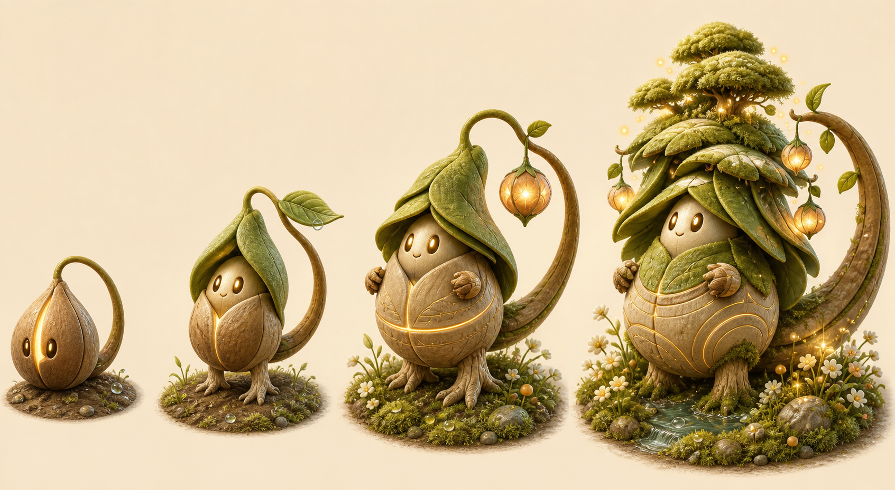
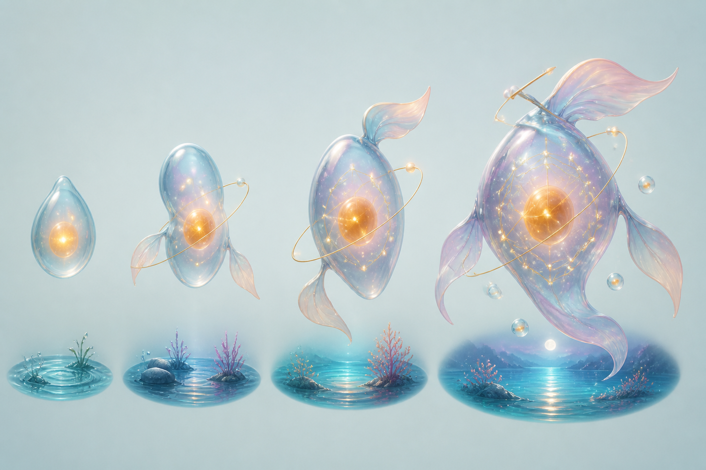
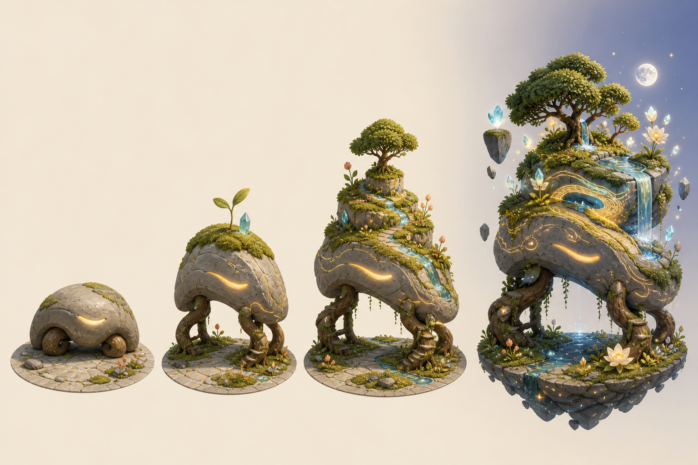
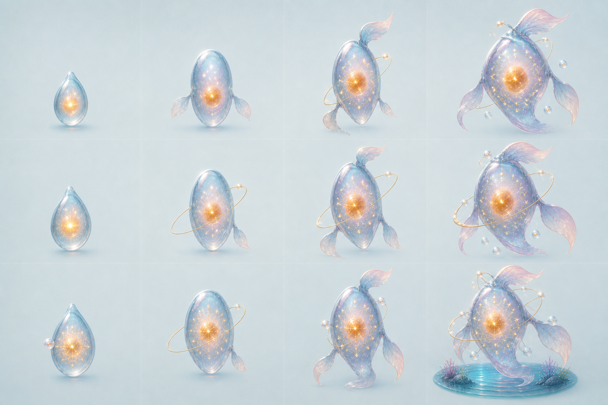
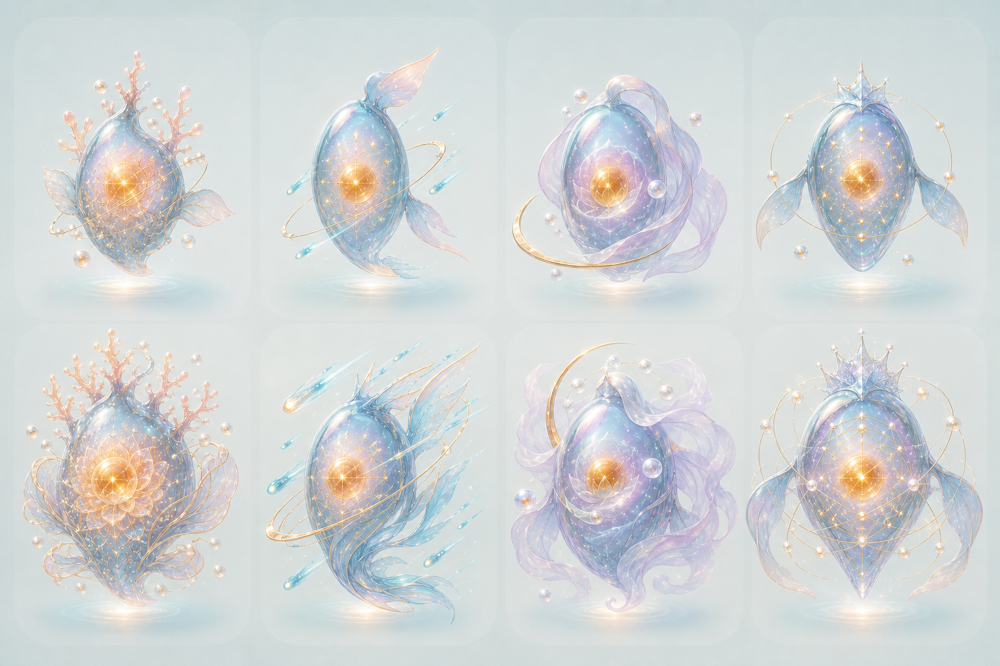
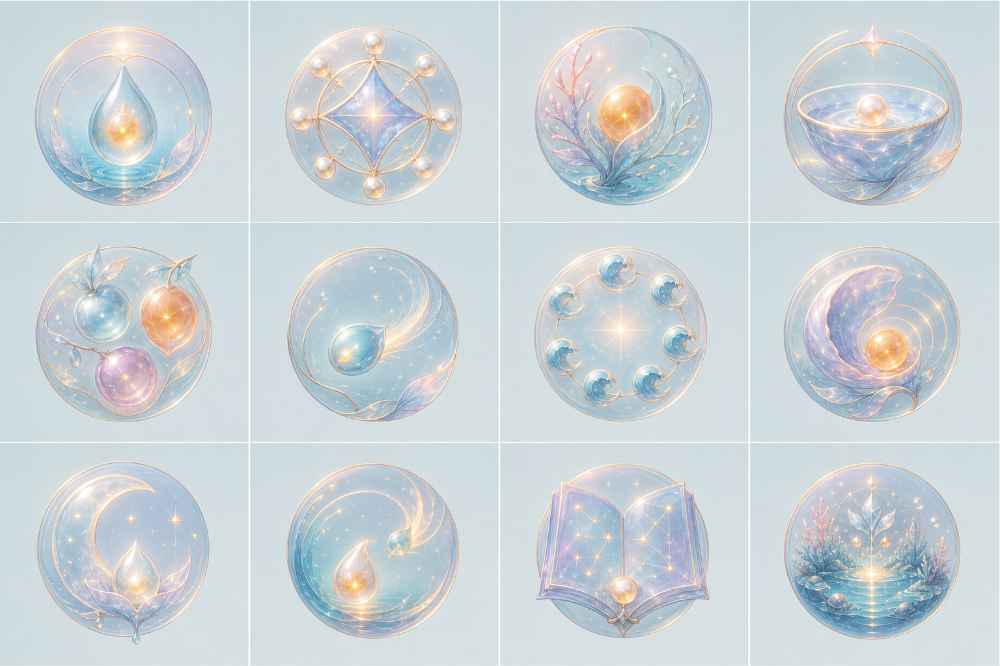

# 減脂追蹤：任務、培育、成就與原創 IP 規格

版本：Draft 0.2

狀態：MVP 規則、持久化、12 階介面與第一批正式美術已實作；親和模組動畫與多週期居民管理列入後續

工作名稱：微光棲地／潤光（正式產品名稱待定）

## 1. 產品目的

將每日健康紀錄轉化為可持續的成就感，但不以體重下降、極低熱量或過量運動作為獎勵條件。

養成系統必須同時做到：

1. 使用者完成與個人計畫一致的任務後，立即看到角色或棲地變化。
2. 體重沒有下降時，誠實紀錄、合理飲食與適當恢復仍可成長。
3. 漏記或暫停使用時不扣分、不死亡、不枯萎、不清空連續進度。
4. 所有健康目標均以目前有效的 `PlanVersion` 或 tracking-only 模式為準。
5. AI 可以選擇任務與撰寫故事，但不能自行判定獎懲，也不能突破安全規則。

## 2. 核心循環

```text
目前計畫／tracking-only 模式
            ↓
產生每日任務與每週焦點
            ↓
使用者填入每日紀錄
            ↓
本機規則計算任務進度
            ↓
完成任務，獲得培育資源
            ↓
角色、棲地、成就立即變化
            ↓
每週回顧，取得進化光核與故事
```

「有填資料」與「有達成目標」必須分開：

- 填寫紀錄：讓系統知道任務進度。
- 達成任務：才取得培育資源。
- tracking-only 使用者沒有健康處方，因此以完成紀錄與建立覺察為任務，不判定熱量或活動是否達標。

## 3. 培育資源

| 資源 | 任務類別 | 代表意義 | 主要美術反應 |
|---|---|---|---|
| 露水 | 覺察 | 完成必要紀錄、回顧身體狀態 | 晨光、露珠、發光紋路 |
| 養分果實 | 滋養 | 達成安全的飲食、蛋白質或飲水任務 | 展葉、果實、體型成長 |
| 風之種 | 活力 | 完成計畫活動，或完成核准的等值替代 | 翅膀、道路、探索動作 |
| 月光 | 恢復 | 睡眠、休息、疼痛／疲勞照顧 | 小巢、月亮、柔軟外觀 |
| 進化光核 | 每週節奏 | 本週達到可持續的任務完成率 | 進入下一成長階段 |

所有日常資源等值。任何一類生活型態都不能成為唯一的「最佳養法」。

## 4. 使用模式

### 4.1 Tracking-only

適用於尚未建立個人計畫或不想接受健康目標的使用者。

- 每日最多 2 項任務。
- 只使用完成紀錄、建立自訂食物、完成週回顧等非處方型任務。
- 不顯示「熱量未達標」「活動不足」或蛋白質、水分目標成敗。
- 靜態能量、動態能量與體重可記錄，但不作為獎懲依據。

### 4.2 Legacy targets

適用於已有舊版手動目標的使用者。

- 養成任務暫時依 tracking-only 處理。
- 舊數字沒有經過目前 Safety Engine 驗證，因此不得直接用來發放達標獎勵。
- 使用者建立新版個人計畫後，改以有效 `PlanVersion` 為準。

### 4.3 Active PlanVersion

適用於已確認手動或 AI 輔助計畫的使用者。

- 每日最多 3 項任務：核心、行為、照顧各最多一項。
- 熱量任務使用 `calorieRangeMinKcal`～`calorieRangeMaxKcal`，不是越低越好。
- 蛋白質使用 `proteinMinG`～`proteinMaxG`。
- 飲水使用 `waterTargetMl`，任務可以採區間或分段進度。
- 活動成果優先使用每週有氧分鐘與肌力天數；動態能量用於分析與進度參考，不作為每日刷分門檻。
- `restingEnergyKcal` 與 `estimatedTdeeKcal` 是分析資料，不是必須達成的行為目標。

## 5. 任務結構

每個任務必須包含：

```ts
type GrowthMission = {
  id: string
  dateOrWeek: string
  cadence: 'daily' | 'weekly'
  category: 'awareness' | 'nourishment' | 'activity' | 'recovery'
  source: 'local_rule' | 'ai_suggested' | 'user_selected'
  metric: AllowedMissionMetric
  operator: 'complete' | 'at_least' | 'within_range' | 'count'
  targetMin?: number
  targetMax?: number
  progress: number
  status: 'available' | 'in_progress' | 'completed' | 'superseded' | 'expired'
  reward: 'dew' | 'fruit' | 'wind_seed' | 'moonlight'
  planVersionId?: string
  safetyAlternativeId?: string
}
```

AI 只能從允許的 `metric` 與 `operator` 中選擇，不能傳入任意公式或可執行條件。

### 5.1 計畫任務必須結構化

目前 `PlanVersion.focusTasks: string[]` 只能作為顯示文字，不能解析自然語言來發獎。正式實作應新增可選白名單：

```ts
focusTaskSpecs?: Array<{
  templateId:
    | 'balanced_intake'
    | 'protein_range'
    | 'water_target'
    | 'sleep_target'
    | 'meal_action'
    | 'weekly_aerobic'
    | 'weekly_strength'
    | 'stable_recording'
}>
```

舊版沒有 `focusTaskSpecs` 時，由本機依有效 PlanVersion 產生安全的預設任務，不解析 `focusTasks` 字串。

### 5.2 發獎與角色狀態

```ts
type RewardLedgerEntry = {
  id: string // 固定為 task:${taskId}
  taskId: string
  xpDelta: number
  category: 'awareness' | 'nourishment' | 'activity' | 'recovery'
  affinityDelta: number
  createdAt: string
}

type CompanionCycle = {
  id: string
  xp: number
  affinities: Record<'awareness' | 'nourishment' | 'activity' | 'recovery', number>
  mainForm: 'light_drop' | 'soft_cluster' | 'flow_ring' | 'star_tide'
  growthNode: 1 | 2 | 3 | 4 | 5 | 6 | 7 | 8 | 9 | 10 | 11 | 12
  maturedAt?: string
}
```

任務必須快照 `planVersionId` 與當時目標；新版本不得回頭改寫歷史任務或已發放資源。

## 6. 任務產生規則

### 6.1 每日數量

- Tracking-only：0～2 項。
- Active Plan：1～3 項。
- 不要求每天都完成三項。
- 每日至少保留一項能在不運動的情況下完成的任務。

### 6.2 任務優先順序

1. 安全與恢復需求。
2. 目前計畫的 `focusTasks`。
3. 最近七天資料不足的必要紀錄。
4. 使用者選定的生活重點。
5. 避免連續多日出現完全相同任務。

### 6.3 每日任務類型

| 類別 | 允許條件範例 | 不允許條件 |
|---|---|---|
| 覺察 | 完成晨間紀錄、完成晚間感受、完成當日結算 | 體重必須下降 |
| 滋養 | 熱量落在安全區間、蛋白質進入計畫區間、達成飲水任務 | 熱量越低獎勵越多、少吃一餐直接獎勵 |
| 活力 | 完成排定活動分鐘、完成本週運動次數、完成活動摘要 | 超過目標持續加分、把每日動態／靜態能量當刷分門檻 |
| 恢復 | 睡眠達標、完成疲勞與不適紀錄、採用恢復替代任務 | 疲勞或疼痛高時仍催促補運動 |

### 6.4 任務替代

以下任一條件成立時，活動任務必須可由恢復任務取代，且獎勵等值：

- 疼痛等級達安全引擎阻擋門檻。
- 疲勞明顯升高。
- 目前傷勢或安全問卷不允許加量。
- 當日被計畫標記為休息日。
- 使用者沒有穿戴裝置，原任務卻依賴動態能量資料。

替代任務完成後，原任務狀態為 `superseded`，新恢復任務仍視為成功，不顯示失敗文案。

## 7. 任務進度與獎勵

1. 每項每日任務完成後只發放一次資源、`XP +10` 與對應親和力 `+1`；同類親和力每天最多增加一次。
2. 每項每週任務完成後發放一次資源、`XP +20` 與對應親和力 `+2`。
3. 超過上限不增加獎勵。
4. 飲食任務在使用者完成當日結算前只顯示「進行中」，避免把尚未記完誤判為吃太少。
5. 沒有足夠資料時顯示「等待紀錄」，不得顯示「未達標」。
6. 任務到期但未完成時只變成 `expired`，不扣資源、不破壞棲地。
7. 使用者補登仍在允許期間內的紀錄後，可以補發對應資源。
8. 每日成長資源有上限，防止透過反覆修改或過量運動刷取。
9. Reward Ledger 使用 `task:${taskId}` 作唯一鍵；重新日結、重試儲存或同步不能重複發獎。

### 7.1 高優先安全覆寫

以下情況的安全決策優先於所有養成任務：

- 不適等級達 Safety Engine 的活動阻擋門檻。
- 疲勞明顯升高或連續惡化。
- 連續兩天出現明顯過大熱量赤字。
- 連續兩天高飢餓感。
- Safety Decision 為 restricted、recovery priority 或 needs confirmation。

處理方式：

1. 活動成果任務改為等值恢復／身體回報任務。
2. 顯示「今天不要求補做」，不得追討活動能量。
3. 過大赤字或高飢餓期間暫停熱量達標獎勵，改成身體回報／查看計畫。
4. 不撤回已取得的資源，不扣除既有進度。

## 8. 每週節奏與進化

每週最多提供三項週任務：穩定紀錄、目前計畫焦點、本週回顧。完成週回顧會播放棲地結算與故事，但不強迫使用 AI。

四張角色主體圖由累積 XP 決定：

| 主型態 | 累積 XP | 可見節點 |
|---|---:|---|
| 光滴 | 0～299 | Lv1～Lv3 |
| 潤團 | 300～839 | Lv4～Lv6 |
| 流環 | 840～1,559 | Lv7～Lv9 |
| 星潮 | 1,560 以上 | Lv10～Lv12 |

完整十二節點見第 15 節。沒有期限、歸零或倒退；成熟後的 XP 轉為「星潮年輪」，只解鎖收藏與紀念圖層。四種任務親和力只影響外觀，不影響成長速度或角色強弱。

## 9. 成就規則

成就分為五組：

1. 覺察：首次完整記錄、完成七次晚間感受。
2. 滋養：完成安全飲食任務、建立自訂食物、嘗試多樣食物。
3. 活力：完成活動計畫、完成第一週活動節奏。
4. 恢復：高疲勞時完成恢復替代、穩定記錄睡眠。
5. 韌性：中斷後重新回來、第一次週回顧、完成一個計畫週期。

禁止：

- 以「連續不間斷天數」作為唯一核心成就。
- 以減重公斤數作為角色存活或升級門檻。
- 以最低熱量、最高赤字或最高活動能量排名。
- 朋友之間比較體重、熱量赤字或運動消耗排行榜。

## 10. AI 職責與邊界

### AI 可以做

- 根據有效 `PlanVersion` 與週摘要推薦下一週焦點。
- 從白名單任務模板中挑選 1～2 個個人化任務。
- 產生一個安全的替代任務建議。
- 撰寫不羞辱、不醫療診斷的每週角色故事。
- 建議棲地氣氛或本週收藏主題。

### AI 不可以做

- 直接寫入任務完成狀態或成就紀錄。
- 自行降低最低熱量或提高活動上限。
- 因為體重沒有下降而扣除資源。
- 在資料不完整時斷言使用者沒有遵守計畫。
- 覆蓋安全引擎的 recovery／needs-confirmation 決策。

### 離線與隱私

- 任務進度、培育資源、角色狀態與成就保存在本機。
- 未同意 AI 時，完整養成系統仍可使用。
- AI 只接收已同意範圍內的必要週摘要，不傳送角色資產或完整本機資料庫。
- AI 失敗時使用本機任務與固定故事，不阻擋紀錄或進化。

## 11. 美術方向總則

正式角色與棲地不用 CSS 繪圖。CSS 僅負責 UI 排版、圖片尺寸、狀態切換及無障礙顯示。

美術資產採以下方式：

1. 先產生三種 IP 風格比較圖。
2. 選定方向後建立唯一角色設定圖，鎖定輪廓、比例、五官與色票。
3. 後續所有階段與表情均以該設定圖作為參考圖，不獨立重新設計。
4. 正式素材拆成角色、表情、培育特徵、前景、背景與特效圖層。
5. 使用 PNG／WebP；需要動畫時使用 sprite sheet、animated WebP 或 Lottie，不以 CSS 圖形代替美術。
6. 不在每日操作中即時生成角色圖，避免延遲、費用與角色漂移。
7. 禁止模仿或近似現有動畫、遊戲、玩具或吉祥物 IP。

## 12. 三種原創 IP 候選

決策：2026-08-11 選定 **B. 潤光（發光軟體型）** 為正式發展方向。A、C 保留為概念封存，不進入第一版角色製作。

### A. 芽尾（種殼陪伴型）



- 核心：三瓣種殼、包覆式葉帽、根足與不對稱彎月莖尾組成的生命。
- 材質：霧面種殼、厚實葉片、絨苔與柔和木質。
- 色彩：燕麥米、鼠尾草綠、深苔綠、杏桃橙、蜜金達成光。
- 情緒：溫暖、安定，最容易產生陪伴與照顧感。
- 四階段：眠種 → 芽行 → 葉旅 → 森冠。
- 培育反應：滋養增加葉層與燈籠果；活力延長莖尾與風葉；恢復增加絨苔與葉巢；覺察形成金色生長環。
- 適合：主吉祥物、首頁陪伴、周邊與角色表情。

### B. 潤光（發光軟體型）



- 核心：非對稱透光生命、偏心琥珀核心、薄膜光鰭與環形軌道。
- 材質：半透明凝膠、珍珠膜、磨砂內核與懸浮光粒。
- 色彩：水霧青、長春花紫、柔珊瑚粉、奶油白、暖琥珀核心。
- 情緒：現代、安靜、偏健康科技感。
- 四階段：光滴 → 潤團 → 流環 → 星潮。
- 培育反應：滋養讓核心飽滿；活力形成流光鰭；恢復形成霧膜與月環；覺察形成星圖節點。
- 適合：數據回饋、柔和動畫、較成熟的數位健康品牌。

### C. 漫嶼（行走棲地型）



- 核心：拱形石質生命、環狀根足與身上的微型棲地；沒有獨立頭頸或動物外型。
- 材質：霧面陶石、軟苔、木栓根與半晶質水流。
- 色彩：暖灰岩、陶土橙、灰藍綠、地衣黃綠、月光白與柔金光縫。
- 情緒：沉穩、有建設感，完成任務就像把自己的世界逐步建起來。
- 四階段：息石 → 苔丘 → 行園 → 浮棲。
- 培育反應：滋養長出樹與泉池；活力形成道路與溪流；恢復形成洞室、苔床與月花；覺察形成晶點和等高線光紋。
- 適合：任務建設、長期收藏、棲地圖鑑與朋友參觀。

### 12.4 初步選型建議

- 想先建立情感連結：A 芽尾。
- 想強調 AI、能量分析與現代感：B 潤光。
- 想讓每個任務直接建造成可見資產：C 漫嶼。
- 最適合產品落地的混合方式：以 A 芽尾作為陪伴角色，採用 C 漫嶼的棲地建設邏輯。

三張概念圖使用的完整提示詞保存於 [IP_CONCEPT_PROMPTS.md](art-concepts/IP_CONCEPT_PROMPTS.md)。

## 13. 第一版美術資產範圍

- 1 個獲選 IP。
- 4 個成長階段。
- 5 種表情：平靜、開心、活力、疲倦、恢復。
- 4 種培育特徵圖層。
- 4 張棲地背景：基礎、滋養、活力、恢復。
- 8 個環境效果：晨光、露水、果實、風、道路、月光、小巢、進化光核。
- 12 個成就徽章。
- 1 張角色設定圖與 1 張色彩／比例規範圖。

## 14. MVP 驗收條件

1. 未建立計畫的使用者不會收到熱量、蛋白質或活動處方任務。
2. 有效計畫的目標調整後，下一次任務生成會引用新的 `PlanVersion`。
3. 熱量低於最低值不會因「吃得更少」取得額外獎勵。
4. 動態能量或運動超標不會重複發放獎勵。
5. 疼痛／疲勞阻擋活動時，可用等值恢復任務完成當日培育。
6. 缺資料只顯示等待紀錄，不顯示未達標。
7. 中斷使用不會讓角色倒退、死亡或失去已解鎖資產。
8. AI 關閉或 API 失敗時，任務、培育與進化仍可運作。
9. 任務完成、資源發放與成就解鎖可被測試重播，不能因重複儲存而重複領取。
10. 角色插畫、棲地與徽章使用正式圖像資產，不以 CSS 圖形繪製。

## 15. 潤光多階段與個體差異方案

### 15.1 設計目標

- 使用者頻繁感受到成長，但不需要製作大量完整角色主圖。
- 同樣經驗值的角色，會因任務類別、選擇與收藏物而不同。
- 中期就開始分化，不必等到最終型才看出差異。
- 所有永久差異都是外觀與故事差異，不提供健康數值加成。

### 15.2 十二個成長節點、四張主體圖



正式母版依主型態分成四欄，每欄由上至下各三個成長節點；App 使用預先切好的 12 張 WebP，不在執行時呼叫 AI 生圖，也不以 CSS 繪製角色。

採用四張完整主體圖，每個主型態各有三個成長節點。中間節點使用美術工具製作的核心、光鰭、環軌、星紋與粒子圖層，不以 CSS 畫角色。

| Lv | 名稱 | 累積 XP | 使用主體圖 | 明顯變化 |
|---:|---|---:|---|---|
| 1 | 光滴・初醒 | 0 | 主體 A | 偏心琥珀核心微光 |
| 2 | 光滴・凝核 | 60 | 主體 A | 核心變亮、增加內部光點 |
| 3 | 光滴・浮珠 | 160 | 主體 A | 出現第一顆環繞星珠與出生印記 |
| 4 | 潤團・萌翼 | 300 | 主體 B | 雙葉膠囊、選擇主要親和力 |
| 5 | 潤團・生環 | 460 | 主體 B | 主要親和力的幼小翼片／尾片 |
| 6 | 潤團・顯紋 | 640 | 主體 B | 主要親和力色澤與軌道紋理完成 |
| 7 | 流環・展尾 | 840 | 主體 C | 三枚光鰭、選擇次要親和力 |
| 8 | 流環・織星 | 1,060 | 主體 C | 次要親和力星紋與粒子 |
| 9 | 流環・雙鳴 | 1,300 | 主體 C | 主、次特徵完成第一次融合 |
| 10 | 星潮・化潮 | 1,560 | 主體 D | 最終大型輪廓形成 |
| 11 | 星潮・棲境 | 1,840 | 主體 D | 個人棲地、光環與漂浮物完成 |
| 12 | 星潮・完全共鳴 | 2,140 | 主體 D | 完整亮度、永久印記與最終稱號 |

MVP 每項每日任務給 10 XP，每日最多 3 項／30 XP；每項每週任務給 20 XP，每週最多 3 項／60 XP。若七天每日任務與三項每週任務都完成，單週理論上限為 270 XP。完整執行約 9～10 週，一般使用節奏約 12～16 週成熟。門檻屬可調參數，但調整不得改寫已完成節點或讓角色倒退。

### 15.3 四種親和力的美術模組



第一版比較圖固定由左至右為：珊芽、疾潮、月幕、星絡；上排為潤團中期，下排為星潮最終。

XP 決定成長節點；任務類別累積的親和力決定外觀。兩者必須分開計算。

| 親和力／印記 | 來源 | 主要輪廓模組 | 內部／軌道模組 |
|---|---|---|---|
| 滋養「珊芽」 | 安全攝取、蛋白質、飲水等滋養任務 | 葉片／珊瑚枝狀光鰭 | 枝脈、種子珠、暖金露珠簇 |
| 活力「疾潮」 | 活動摘要、有氧分鐘、肌力天數 | 修長後掠光鰭、流線尾翼 | 高傾角星環、青藍彗星粒子 |
| 恢復「月幕」 | 睡眠、疲勞照顧、恢復替代任務 | 圓潤薄紗鰭、包覆型披幕 | 月牙、霧藍珍珠氣泡 |
| 覺察「星絡」 | 晨晚紀錄、日結、週回顧 | 水晶冠紋、細長感知光帶 | 對稱星圖、白金珍珠節點 |

所有型態保留水晶藍身體、暖金核心、珍珠光與水生生命感；親和色最多約占 30%。每種親和力製作三個強度的透明美術模組，且不能只靠顏色區分。模組必須與四張主體圖共用固定畫布、視角、中心點與錨點。

### 15.4 中期與最終分化

1. Lv1～Lv3：所有潤光維持共同血統，只由四種固定「出生印記」產生細微星珠排列差異。
2. Lv4：系統依目前章節的親和力找出前兩名，推薦兩個「第一印記」選項，由使用者確認；中期輪廓開始分化。
3. Lv7：再次依下一章節親和力推薦「第二印記」；可以選不同親和力，也可以再次選擇第一印記形成純系型。
4. Lv10：第一印記控制主要鰭翼與輪廓；第二印記控制內紋、環軌、衛星與環境效果。
5. Lv12：使用主體 D，完成雙印記融合、棲地與最終稱號。
6. 接近平手時必須讓使用者從前兩名中選擇，不能因極小差距強迫分支。

「先活力、後恢復」與「先恢復、後活力」是不同歷程：第一印記決定主要輪廓，第二印記決定內部紋理與衛星。系統負責推薦，使用者保留最後選擇權。永久印記只在里程碑記錄，不因隔天任務比例改變而突然換型；最近 14 天狀態只影響可變光環。成熟後每月可免費重新調律一次，舊型態保留於圖鑑。

### 15.5 最終型組合數

只製作一張最終主體圖，透過圖像模組即可產生：

- 第一、第二印記相同：4 種純系歷程。
- 第一、第二印記不同：12 種有先後順序的混合歷程。
- 4 種由角色種子固定的出生印記／珍珠排列。
- 4 種反映近期狀態、可隨時間更換的光環。

不額外繪製完整主圖的情況下，可組成至少 `16 × 4 × 4 = 256` 種外觀感受。出生印記與近期光環只影響純外觀，不影響任務、獎勵或健康結果。

### 15.6 成就收藏層



成就不改變角色強度，只解鎖可自由裝備的美術圖層：

- 回來就好：回歸星粒。
- 聽見身體：月光衛星滴。
- 第一次週回顧：第二環軌。
- 穩定記錄：星圖節點樣式。
- 完成一個培養週期：新核心色或棲地背景。

使用者可換裝成就層，因此兩位親和力相同的使用者仍能保有不同外觀。

### 15.7 第一版美術資產估算

| 資產 | 數量 | 說明 |
|---|---:|---|
| 完整中性主體 | 4 | 光滴、潤團、流環、星潮 |
| 過渡節點 | 8 | 每張主體另外兩個節點變化 |
| 第一印記輪廓模組 | 12 | 四親和力 × 後三個主型態 |
| 第二印記內紋／軌道 | 8 | 四親和力 × 後兩個主型態 |
| 出生印記 | 4 | 星珠／珍珠固定排列 |
| 情緒／近期光環 | 6 | 平靜、愉快、專注、想休息、慶祝等 |
| 棲地背景（選配） | 4 | 水窪、泉眼、潟湖、星潮棲地 |
| 純系完成冠（選配） | 4 | 四種同印記完成裝飾 |

核心版約 42 個邏輯資產，含選配約 50 個；部分鰭翼需拆成前後層，實際輸出約 58～64 個檔案，但完整角色主圖仍只有 4 張。正式資產使用透明 PNG／WebP、animated WebP 或 sprite sheet；每日畫面不呼叫 AI 即時生圖。

固定圖層順序：棲地／水面 → 後方光鰭 → 完整主體 → 核心與內部星紋 → 前方光鰭 → 環軌與衛星 → 狀態光環。首頁只預載目前節點與下一節點，單次角色素材目標控制在約 0.7～1.2 MB。

### 15.8 實作資料

```ts
type LuminousCompanionState = {
  cycleId: string
  xp: number
  mainForm: 'light_drop' | 'soft_cluster' | 'flow_ring' | 'star_tide'
  growthNode: 1 | 2 | 3 | 4 | 5 | 6 | 7 | 8 | 9 | 10 | 11 | 12
  affinities: Record<'awareness' | 'nourishment' | 'activity' | 'recovery', number>
  firstImprint?: 'awareness' | 'nourishment' | 'activity' | 'recovery'
  secondImprint?: 'awareness' | 'nourishment' | 'activity' | 'recovery'
  birthMarkId: string
  recentAuraId?: string
  equippedAchievementAssetIds: string[]
  maturedAt?: string
}
```

每次階段、共鳴選擇與裝備變更都需保存；重載、離線與備份還原後必須得到完全相同的外觀。

備份沿用核心 `schemaVersion: 1`，以 optional `growth` 保存完整 `GrowthSnapshot`；舊版沒有 `growth` 的 v1 備份仍可匯入。匯入或清除時，核心資料與培育資料必須在同一個互斥流程內完成，任一步驟失敗都要回復原核心資料。清除「本機追蹤與培育資料」會重置 Growth DB，但保留另外匯出的長期計畫資料；匯出檔需明確提醒它含敏感健康與培育衍生資料。

### 15.9 成熟棲境與居民


- Lv12 的潤光以成熟居民身分顯示在星潮棲境，不會因漏記或暫停而消失。
- 棲境中央保持留白，正式畫面最多同時展示三名成熟居民；其餘居民由圖鑑管理。
- MVP 先保存目前週期的成熟居民；開始下一培育週期與歷代居民切換需使用明確操作，不得自動重置 XP。
- 棲境、居民與成就使用正式點陣素材；CSS 只處理版面、堆疊與可存取狀態。
